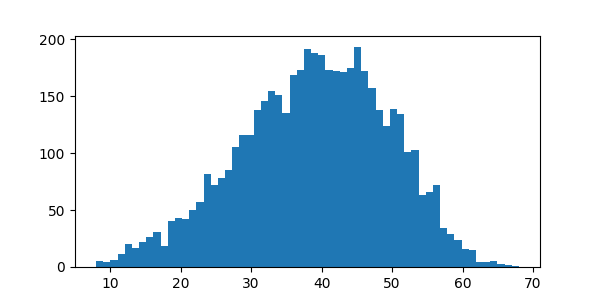
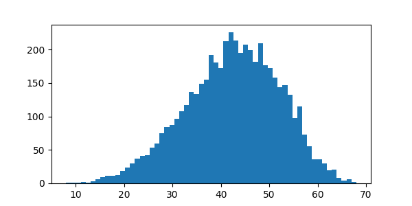

# Bingo

A simple bingo game that I wrote to learn python3.



## The Animation

### The Install
```bash
# Create virtualenv named '.venv'
python3 -m venv .venv
# Activate virtualenv
source .venv/bin/activate
pip3 install termtosvg
```

### Create
```bash
termtosvg
./bingo.py
^d
```

## Run Stats on the Log

So after 1500 games with just 1 card, it looks like 

```text
(.venv) jeffsuess@Jeffs-MacBook-Pro bingo % ./scanLog.bash
Counted 1500 lines.
mode   44
median 42.0
mean   41.52466666666667
var    96.60045852790749
pvar   96.53605822222222
stdev  9.828553226589735
pstdev 9.825276495968051
(.venv) jeffsuess@Jeffs-MacBook-Pro bingo %
```


# plot

```text
pip install termplotlib
```
## Histograms

### All Games



### Bingos Using 4 Spaces

- both diagonals
- 4 corners
- row 3
- column N


### Bingos Using 5 Spaces

- rows 1, 2, 4 and 5
- columns B, I, G and O


